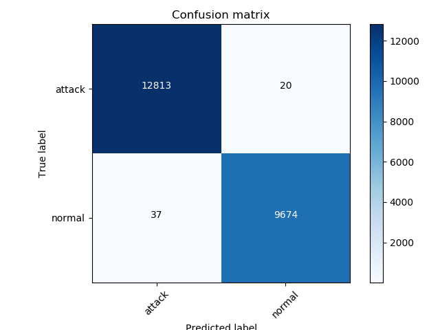

# Analytikers

NSW Hackathon 2020
5G Malicious traffic detection

**Purpose of the project:**
The project was initiated for NSW Hackathon 2020 for creating a basic 
solution framework to handle cyber security attacks in 5G network. This project
has evaluated the possibility to recognize attacks based on ML Neural Networks.
It introduced the concept of mobile edge computing for security by getting 
streaming traffic from RAN and searching for malicious traffic on mobile egde
side to achive quick recognition of threats.
In that way it differentiates from solutions (e.g. VoltDB), which need to have
data from core network stored and in a second step evaluate for possible 
threats.

**Motivation:**
Cyber security defense systems have evolved in
the last years with innovative approaches and new Intrusion
Detection Systems (IDS) capable of identifying cyber-threats
that had gone unnoticed to date. However, new protection
challenges are raised by the upcoming fifth generation (5G)
mobile technology with new and advanced features. The project introduces a 
5G-oriented architecture with which to conduct the analysis of network flows
to identify cyber-threats in 5G mobile networks efficiently and
quickly, by making use of deep learning techniques. Additionally this project
would like to introduce "armed microservices" approach. A microservice can be 
launched with own ML algorithm and training set to defend against certain 
groups of threats, like DOS, U2R, R2L, probe but also telecom specific threats
like M3UA threats, SMS fraud ans spam.

**System Components:**
*  Stream data capture and flow generation by using Argus binetflow
   https://openargus.org/ . Time window feature aggregation will be evt. 
   implemented with Spark. This step is not part of hackathon and will be 
   introduced as next step.
*  ASD: Anomaly symptom detection. It is located into the Radio Access Network 
   (RAN) infrastructure, and it is focused on the quick search of anomaly 
   symptom, i.e., any trace or sign of anomaly in the network traffic 
   generated by UEs connected to the RAN. This component is part of Hackathon 
   implementation using Deep Neural Network fully connected. However the data
   used are not real RAN data but datasets used for Malicious traffic ML
   projects, like KDD and CTU-13.
*  NAD: Network anomaly detection. It is a collector of timestampted and 
   RAN-associated symptoms, produced and forwarded by ASDs, where a central 
   process in e.g. EPC analyses the timeline and the relation of these symptoms 
   to identify any network anomaly. Once an anomaly is produced, it is 
   immediately communicated to the Monitoring and Diagnoser module. This 
   component is part of Hackthon implementation using an RNN LSTM network.
*  Diagnose and policy server. A GUI environment, which produces graphs of 
   interconnected infected devices and in case of botnets also the botmasters.
   It provides the capability to an expert to look deeper to flow packages
   and initiate prevention actions. This component is only partly implemented
   for the Hackathon. Only the graph generation was implemented.

Dataset used for training:
NSL-KDD: 

**ASD NN Network description and results:**
Full connected deep neural network.
RandomSearchCV was used for training with cross validation and best parameters 
extracted are the following:

*  3 hidden layers
*  hidden layer 1 = 256 neurons
*  hidden layer 2 = 32 neurons
*  hidden layer 3 = 32 layers
*  learning_rate = 0.0003467
*  Kernel initializer = glorot_uniform
*  Dropout = 0.2

Training data:

*  Epochs = 75
*  verbose =2
*  batch size = 2000
*  scoring = f1_macro
*  optimizer = RMSprop
*  loss = binary_crossentropy

DNN results:
| precision | recall | f1-score | support |
           0       1.00      1.00      1.00     12833
           1       1.00      1.00      1.00      9711

    accuracy                           1.00     22544
   macro avg       1.00      1.00      1.00     22544
weighted avg       1.00      1.00      1.00     22544

Best score:  0.9999680776451911
Estimator time: 645.5822646617889
Prediction time: 0.7374951839447021
Total time for fit and predict: 646.3197634220123 seconds

 
 
 
**NAD NN Network description and results:**
LSTM : Long short term memory recurrent neural network.
RandomSearchCV was used for training with cross validation and best parameters
hidden_layers =4
learning_rate = 0.0002267

LSTM results:
precision    recall  f1-score   support

           0       1.00      1.00      1.00     12833
           1       1.00      0.99      1.00      9711

    accuracy                           1.00     22544
   macro avg       1.00      1.00      1.00     22544
weighted avg       1.00      1.00      1.00     22544

Best score: 0.9998968032832433
Estimator time: 956.7115938663483
Prediction time: 1.4246132373809814
Total time for fit and predict: 958.1362102031708 seconds
Confusion matrix:
[[12825     8]
 [   51  9660]]
 